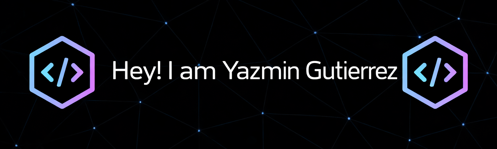

🔴🟡🟢

 
 

  
  
<strong style="color: #b19cd9;">Desarrolladora | Frontend | Backend | Automatización</strong>

  ##  &nbsp;Tech Stack

  

  
  ### Frontend
  
  

  

  
  &nbsp; &nbsp; &nbsp; &nbsp; &nbsp; 
  
  

  

  
  ### Backend
  
  

  

  
  &nbsp; 
  
  

  

  
  ### Bases de Datos
  
  

  

  
  &nbsp; 
  
  

  

  
  ### Automatización
  
  

  

  
  
  
  

  

  
  ### Herramientas
  
  

  

  
  &nbsp; &nbsp; &nbsp; 
  
  

  

  

  ##  &nbsp;Mis Contactos

  

  
  &nbsp; &nbsp; &nbsp; &nbsp;
  
  

 

  

